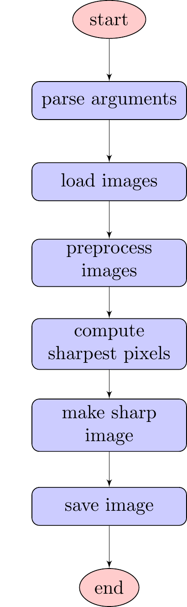
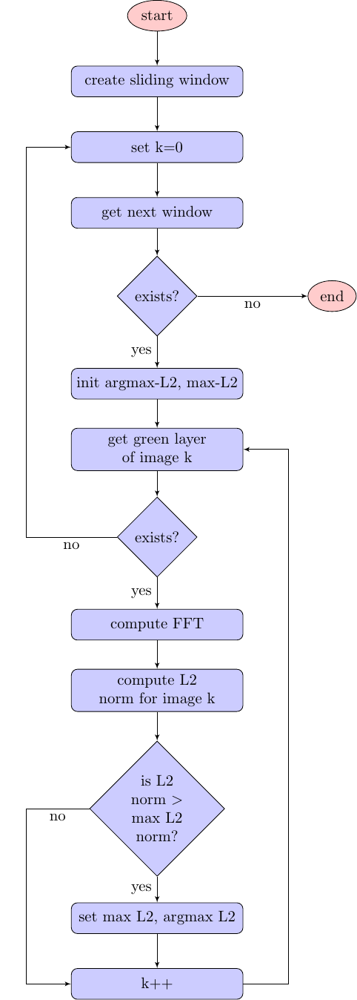

# Toteutus

## Oletuspaketti

Oletuspakettiin sisältyy kaksi luokkaa: pääohjelmaluokka <a href="#Main">```Main```</a> ja ohjelman varsinaisen toiminnallisuuden toteuttava <a href="#FocusStacking">```FocusStacking```</a> -luokka. 

<a name="Main"></a>
### Main.class

Main-luokkaan on toteutettu ohjemakutsuun vastaava oletusmetodi ```main``` ja sen lisäksi metodeja parametrien käsittelyyn (```parseArguments``` ja ```argumentsToString```) sekä ohjelman varsinaisen toiminnallisuuden käynnistävä ```makeImageStack``` -metodi. 

Pääohjelman ```main``` kulku on kuvattu seuraavassa kaaviossa:

<a name="paaohjelma"></a>


Javadoc: <a href="https://eevalaiho.github.io/FocusStacking/javadoc/Main.html">https://eevalaiho.github.io/FocusStacking/javadoc/Main.html</a>

#### Ulkopuoliset kirjastot

Luokkaan on tuotu ulkopuolisia kirjastoja ```java.io.IOException``` ohjelman virheiden käsittelyä ja hallintaa varten  sekä ```java.time.LocalDateTime``` uloskirjoitettavan tiedoston uniikkia nimeämistä varten.

<a name="FocusStacking"></a>
### FocusStacking.class

FocusStacking-luokkaan on toteutettu metodeja kuvatiedostojen lataamiseen ja tallentamiseen (```loadImages```, ```saveImages```), kuvien tarkimpien pikselien laskemiseen (```computeSharpestPixels```) ja tarkimpien pikselien matriisin tulostamiseen ohjelman toiminnallisuuden testaamista ja todentamista varten (```printSharpestPixelIndexes```).

Metodi ```computeSharpestPixels``` sisältää harjoitustyön ydintoiminnallisuuden eli kuvien tarkimpien pikselien laskemisen ja valinnan. Metodin kulku on kuvattu seuraavassa kaaviossa:
<a name="tarkimman"></a>


#### Ulkopuoliset kirjastot

Luokkaan on tuotu projektin ulkopuolisia kirjastoja ```java.io.IOException``` ohjelman virheiden käsittelyä ja hallintaa varten.

## Domain

### FFT

### SlidingWindow

## IO

### MyImage

### MyImageIO

### RGB

## Util

### Complex

### Math

### MyArrayList

### Util

