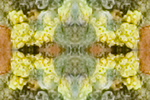
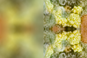
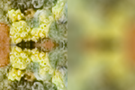
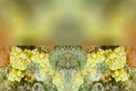
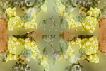
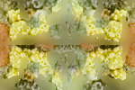
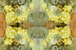
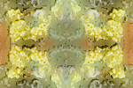
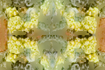
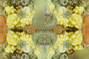

# Testaus

## Yksikkötestaus

Testikattavuus: https://eevalaiho.github.io/FocusStacking/coverage/index.html

## Järjestelmätestaus

Ohjelman järjestelmätestausta varten on [Apysinia fulva -merikorallia esittävästä kuvasta](https://free-images.com/display/aplysina_fulva_png.html) tehty 150x100 kuvapisteen kokoisia testikuvia (alla). Kuvat on tehty kuvankäsittelyohjelmalla siten, että kuvasta on ensin leikattu 75x50 kuvapisteen kokoinen pala. Tämä pala on peilattu ensin vertikaalisesti niin, jolloin on saatu 75x100 kuvapisteen kokoinen kuva, joka sitten on peilattu horisontaalisesti. Näin kuvasta on saatu joka neljännekseltään yhtä tarkka kuva (alla).  

Tämän jälkeen kuvasta on edelleen muokattu kolme testikuvaa, joissa on sumennettu joko vasen-, oikea- tai yläpuoli (alla). 

### Eri värikanavien testaus

Tarkkojen pikselien valinnassa käytetty värikanava vaikuttaa ohjelman tuottamiin kuviin. Seuraavat kuvat on tuotettu 32 pikselin ikkunakoolla (punainen, vihreä, sininen):

Kuvista voi havaita silmämääräisesti, että eri värikanavaa käyttämällä kuvaan valikoituu pikseleitä eri kuvista. Tällä kuvalla sininen värikanava tuottaa silmämääräisesti parhaan tuloksen. 

### Eri ikkunakokojen testaus

Kun sinistä värikanavaa käytetän eri ikkunakoilla (8, 16, 32, 64) ohjelma tuottaa seuraavat kuvat:

Kuvista huomataan, että ikkunan koon kasvattaminen näyttäisi silmämääräisesti parantavan algoritmin tarkkuutta ikkunakokoon 32px asti. 

## Suorituskyytestaus

Ohjelman suorituskykytestauksessa testattiin ikkunakoon ja kuvakoon vaikutusta ohjelman suoritukseen kuluvaan aikaan. Suorituskykytestauksen yhteenvetoraportit:

* Kuvan koko: https://eevalaiho.github.io/FocusStacking/performance/imageSize/Overview.html
* Ikkunan koko: https://eevalaiho.github.io/FocusStacking/performance/windowSize/Overview.html

