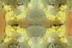

# Testaus

## Yksikkötestaus

Testausraportti: 

Testikattavuus: [https://eevalaiho.github.io/FocusStacking/coverage/index.html](https://eevalaiho.github.io/FocusStacking/coverage/index.html)

## Järjestelmätestaus

Ohjelman järjestelmätestausta varten on [Apysinia fulva -merikorallia esittävästä kuvasta](https://free-images.com/display/aplysina_fulva_png.html) tehdty 150x100 pikselin kokoisia testikuvia (alla). Kuvat on tehty kuvankäsittelyohjelmalla peilaamalla 75x50 pikselin kokoinen pala kahteen suuntaan. Tarkoituksena on ollut saada joka neljännekseltään yhtä tarkka kuva. 

Näin saadusta kuvasta on muokattu kolme testikuvaa, joissa kuvankäsittelyohjelmalla on sumennettu joko vasen-, oikea- tai yläpuoli. 

Kun ikkunan koko on 16, algoritmi tuottaa kuvan:

Kun ikkunan koko on 32, algoritmi tuottaa kuvan:

